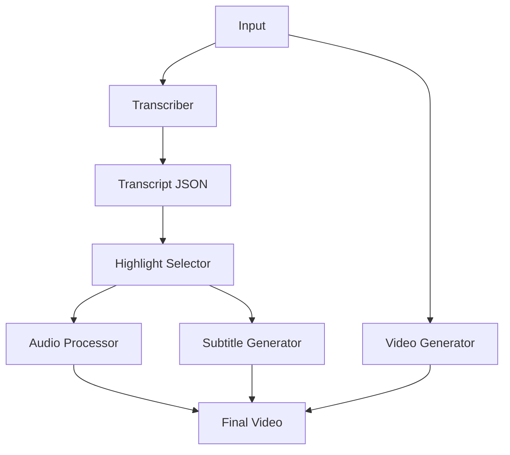
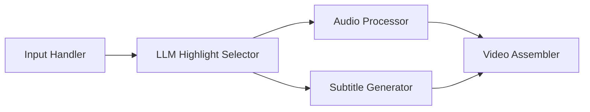
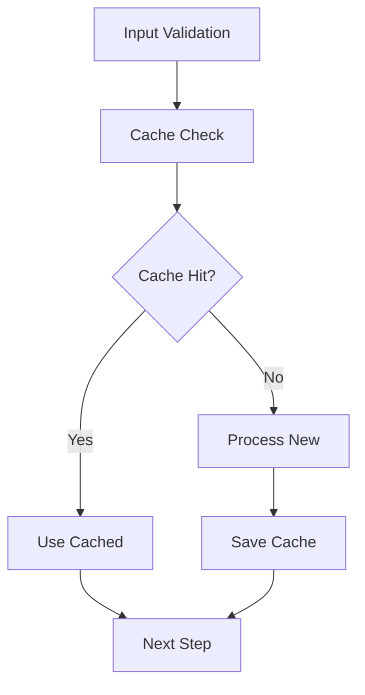
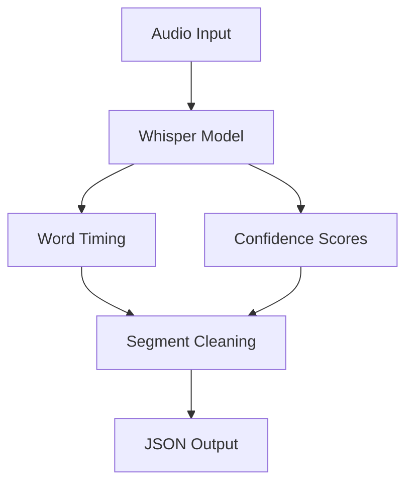
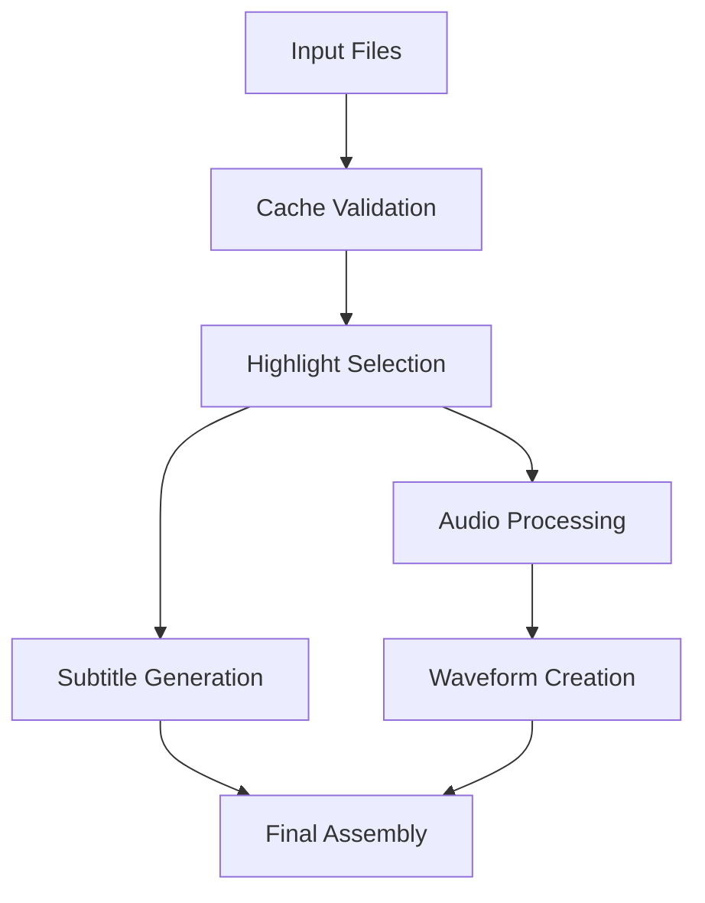

# System Patterns

## Architecture Overview

### Component Structure

## Key Components

### 1. Transcriber (transcribe.py)
- Uses Whisper-timestamped for audio transcription
- Implements voice activity detection (VAD)
- Handles word-level timing and confidence scores
- Cleans and deduplicates segments
- Outputs standardized JSON format

### 2. Video Generator (karaokify.py)
#### Core Modules

#### Caching System
- Implements file hashing for cache validation
- Caches intermediate files:
  - Extracted audio
  - Waveform video
  - Highlight segments
  - Trimmed audio

## Technical Patterns

### 1. File Processing Pipeline

### 2. Error Handling
- Comprehensive FFmpeg command validation
- LLM fallback mechanisms for highlight selection
- Cache validation with SHA-256 hashing
- Graceful handling of missing dependencies

### 3. Performance Optimizations
- GPU acceleration for transcription when available
- Efficient caching of intermediate files
- Parallel processing where possible
- Memory-efficient file handling

## Design Decisions

### 1. Transcription
- **Choice**: Whisper-timestamped over vanilla Whisper
- **Rationale**: 
  - Better timestamp accuracy
  - Word-level confidence scores
  - Built-in VAD support
  - Disfluency detection

### 2. Video Generation
- **FFmpeg Integration**:
  - Direct command execution for performance
  - Complex filter graphs for effects
  - Hardware acceleration support
  - Format flexibility

### 3. Subtitle System
- **ASS Format Choice**:
  - Rich styling capabilities
  - Word-level timing control
  - Efficient rendering
  - Multi-layer support

### 4. Highlight Selection
- **LLM Integration**:
  - Context-aware selection
  - Flexible duration control
  - Fallback mechanisms
  - Cached results

## Data Flow

### 1. Transcription Flow

### 2. Video Generation Flow

## Extension Points

### 1. Input Processing
- Support for additional audio/video formats
- Custom input preprocessing
- Batch processing capabilities

### 2. Output Customization
- Additional visual effects
- Custom subtitle styles
- Alternative waveform visualizations

### 3. LLM Integration
- Support for different LLM providers
- Custom prompt engineering
- Alternative selection strategies

## Configuration Management

### 1. Command-line Arguments
- Comprehensive argument parsing
- Sensible defaults
- Clear documentation

### 2. Environment Variables
- LLM API credentials
- System-specific settings
- Debug configurations

### 3. Resource Management
- Temporary file cleanup
- Cache size control
- Memory usage optimization
