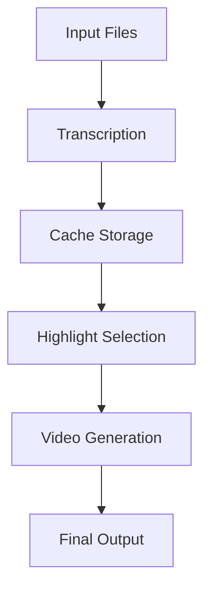

# System Patterns

## Architecture Overview

### Component Structure
1. **Transcription Module (transcribe.py)**
   - Handles audio processing and transcription
   - Uses Whisper-timestamped for word-level timing
   - Outputs standardized JSON format
   - Implements caching for efficiency

2. **Video Generation Module (karaokify.py)**
   - Manages video creation and effects
   - Handles subtitle rendering and highlighting
   - Creates waveform visualizations
   - Implements smooth transitions

### Data Flow


## Design Patterns

### 1. Caching Pattern
- Use SHA-256 for file validation
- Cache transcription results
- Store intermediate video segments
- Implement cache cleanup

### 2. Factory Pattern
- Create video effects
- Generate waveform visualizations
- Build subtitle renderers
- Handle file format conversions

### 3. Strategy Pattern
- Select transcription models
- Choose highlight algorithms
- Configure video effects
- Manage audio processing

### 4. Observer Pattern
- Monitor processing progress
- Track cache usage
- Handle error events
- Update status indicators

## Implementation Patterns

### 1. File Processing
```python
def process_file(file_path: str) -> bool:
    """
    Template for file processing operations.
    Includes validation, processing, and cleanup.
    """
    try:
        validate_file(file_path)
        process_content(file_path)
        cleanup_temporary_files()
        return True
    except Exception as e:
        handle_error(e)
        return False
```

### 2. Cache Management
```python
def cache_operation(key: str, operation: Callable) -> Any:
    """
    Template for cache operations.
    Implements check-compute-store pattern.
    """
    if cache_exists(key):
        return load_from_cache(key)
    result = operation()
    save_to_cache(key, result)
    return result
```

### 3. Error Handling
```python
def safe_operation(operation: Callable) -> Result:
    """
    Template for error handling.
    Includes logging and cleanup.
    """
    try:
        return operation()
    except Exception as e:
        log_error(e)
        cleanup()
        raise
```

## Technical Patterns

### 1. Resource Management
- Implement context managers for file handling
- Use memory-efficient processing
- Clean up temporary resources
- Monitor system resources

### 2. Concurrency
- Process large files in chunks
- Implement parallel processing where beneficial
- Use async operations for I/O
- Manage thread pools efficiently

### 3. Configuration
- Use environment variables for settings
- Implement configuration validation
- Support command-line arguments
- Maintain default configurations

## Testing Patterns

### 1. Unit Testing
- Test individual components
- Mock external dependencies
- Verify error handling
- Check edge cases

### 2. Integration Testing
- Test component interactions
- Verify end-to-end flows
- Test with various input types
- Validate output quality

### 3. Performance Testing
- Monitor processing speed
- Check memory usage
- Verify cache efficiency
- Test with large files

## Maintenance Patterns

### 1. Code Organization
- Maintain clear module structure
- Use consistent naming conventions
- Document public interfaces
- Keep related code together

### 2. Documentation
- Update Memory Bank files
- Document complex algorithms
- Maintain API documentation
- Include usage examples

### 3. Version Control
- Use meaningful commit messages
- Track significant changes
- Document breaking changes
- Maintain change history
